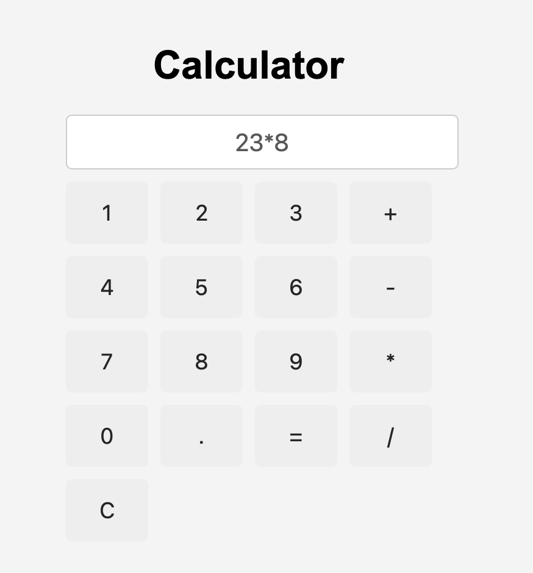

# JavaScript Calculator

A simple calculator built with HTML, CSS, and JavaScript.

## Preview

## Features
- Basic calculations: addition, subtraction, multiplication, division
- Clear button to reset the display
- Prevents starting with an operator
- Prevents double operators
- Prevents multiple decimal points
- Simple card-style UI

## Technologies
- HTML
- CSS
- JavaScript

## How to use
1. Click the number buttons
2. Choose an operator
3. Click `=` to calculate the result
4. Click `C` to clear the display

## What I learned
- Handling button clicks with JavaScript
- Reading custom `data-value` attributes
- Updating the DOM dynamically
- Basic input validation
- Using Git and GitHub for version control

## Status
Finished – basic calculator project

## Notes
This project was built as part of my preparation for studying Computer Science.
